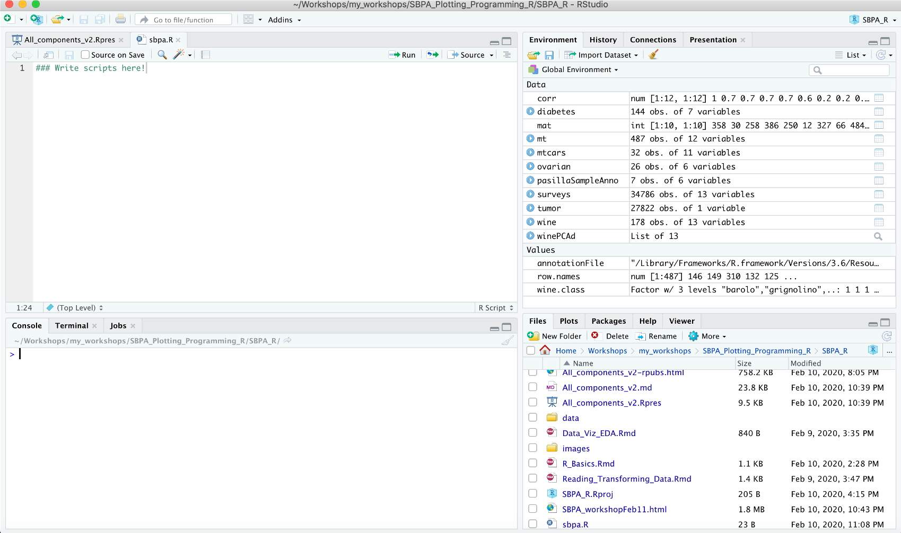
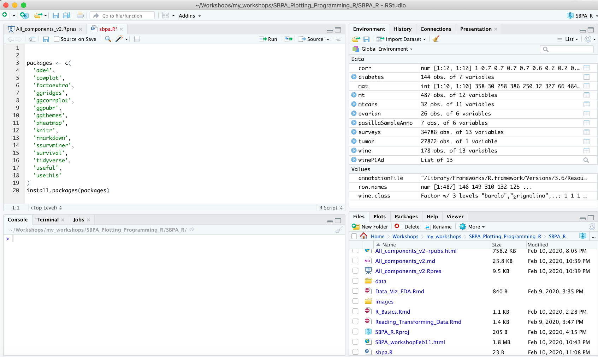

# R Fundamentals for Data Wrangling and Visualization
## SBPA Workshop


Please follow the instructions  below to set up your environment for the
workshop.

# Install R

Download and install the latest version of R [here](https://www.r-project.org/)

Download and install (the free version of) RStudio [here](https://rstudio.com/)

Open R Studio. The interface should look like this.



# Packages

To get started run the following code to install the latest version of
the necessary packages in R Studio.

<div class="sourceCode">

<pre class='sourceCode r'><code class='sourceCode r'>
packages <- c(
    'ade4',
    'cowplot',
    'factoextra',
    'ggridges',
    'ggcorrplot', 
    'ggpubr', 
    'ggthemes', 
    'pheatmap', 
    'knitr', 
    'rmarkdown',  
    'ssurvminer',  
    'survival', 
    'tidyverse', 
    'useful', 
    'usethis'
)
install.packages(packages)
</code></pre>

</div>



# Project Structure

Making use of RStudio projects greatly improves the user experience. To
facilitate this users should run the following code which will recreate
this project on their computer. Be sure to select the positive prompts
such as `yes`, `yeah`,
etc.

``` r
newProject <- usethis::use_course('https://github.com/ltcguthrie/R_DataTidy_Viz_SBPA/archive/master.zip')
```


After running this code you will be in an RStudio Project called
R_DataTidy_Viz_SBPA. You can see this in the top right of RStudio.
